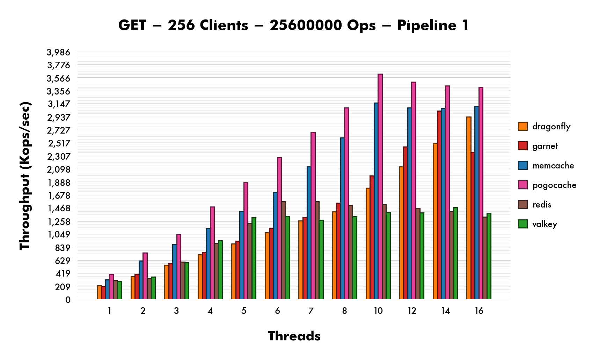
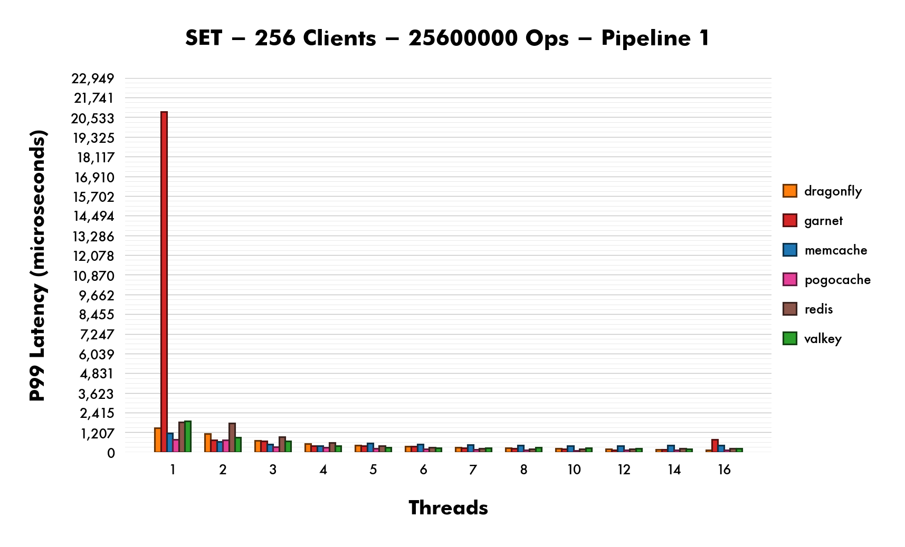
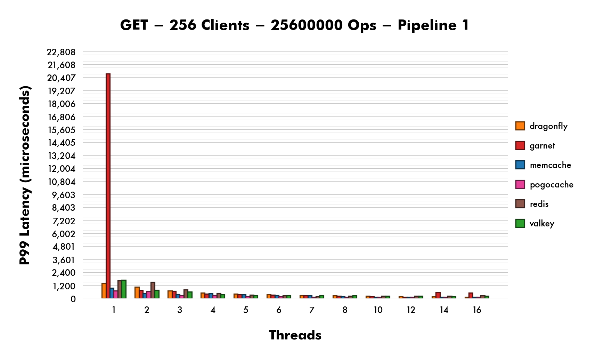
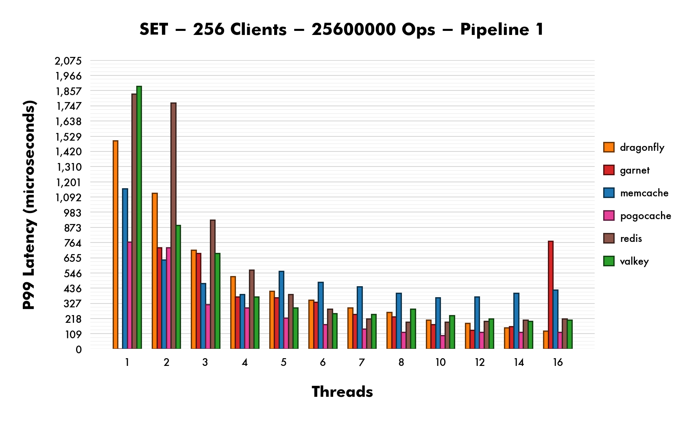

# Cache Benchmarks

These benchmarks measure thoughput, latency, and CPU cycles for
[Memcache](https://github.com/memcached/memcached),
[Redis](https://github.com/redis/redis),
[Valkey](https://github.com/valkey-io/valkey),
[Dragonfly](https://github.com/dragonflydb/dragonfly),
[Garnet](https://github.com/microsoft/garnet), and
[Pogocache](https://github.com/tidwall/pogocache).

- Persistance is turned off for all caches, no disk operations.
- All connections are local, UNIX named pipes.
- The hardware is an AWS c8g.8xlarge (32 core non-NUMA ARM64).
- The benchmarking tool is [memtier_benchmark](https://github.com/RedisLabs/memtier_benchmark).
- Includes pipelining for 1, 10, 25, and 50.
- Each benchmark has 31 runs. About 15K total runs.
- The median of the 31 is used for graphing.
- Latency is measured in 50th, 90th, 99th, 99.9th, 99.99th percentiles.
- Latency also includes MAX, the absolute slowest single request.
- CPU cycles are measured using the `perf` Linux utility.

The "Threads" at the bottom of each graph represents the number of I/O Threads
that the caching server software is configured to use for that specific benchmark.
All caching software benchmarked has some type of multithreaded networking support through
the following startup flags.

- Memcache: `-t`
- Redis: `--io-threads`
- Valkey: `--io-threads`
- Dragonfly: `--proactor_threads`
- Garnet: `--miniothreads/maxiothreads --minthreads/maxthreads`
- Pogocache: `-t`

For each benchmark, a fresh instance of the cache server software is started,
which is dedicated to 16 cores using `taskset -c 0-15`.
The memtier_benchmark tool uses the other 16 cores `taskset -c 16-31`.
Of those 16 cores, there are 256 clients spread evenly between 16 threads.
Those clients perform 100K SET and 100K GET operations, each.

There's a warmup stage that occurs at the start of each run, just after the
cache software is started. It performs a dry run of all SET operations.
This warmup is not a part of the measurements.

The `./bench-all.sh` scripts starts running the benchmarks and produces results
that are placed in the [results](results) directory. 
Expect it to take about two weeks from start to finish to complete all runs.

| CACHE | VERSION |
| ----- | ------- |
| memcached | 1.6.38 |
| Redis | v=8.2.1 sha=cd0b1293:0 malloc=jemalloc-5.3.0 bits=64 build=4223e47892f6315a |
| Valkey | v=8.1.1 sha=fcd8bc3e:0 malloc=jemalloc-5.3.0 bits=64 build=538068b40a1d8f11 |
| dragonfly | v1.30.3-a8c40e34757396a034e98b2c1c437dd568b50c8a |
| Garnet | 1.0.65+381bb797fb158d163cd74996f7b1cfff713069fe |
| Pogocache | 1.0.0 |

# Benchmarks

Below are five important benchmarks presented in linear scale.
There are over 150 graphs in total.
To see them all choose one of the following options.

- [All Benchmarks Linear Scale](LINEAR.md)
- [All Benchmarks Logarithmic Scale](LOGARITHMIC.md)

## Throughput

## Latency 99th Percentile

*NOTE: Garnet was removed for thread 1 due to very high latency*

 

**See results with Garnet**

## CPU Cycles

